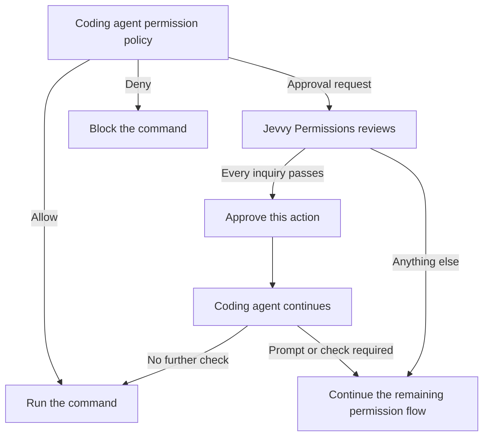

<div align="center">

# Jevvy

**Jev-powered plugins for coding agents**

Jevvy is a home for plugins that use [Jev](https://typesafe.ai), TypeSafe's System One model, to make fast probabilistic judgments inside coding-agent workflows.

<p align="center">
  <a href="https://github.com/PanAchy/jevvy/blob/main/LICENSE"></a>
</p>

</div>

## Jevvy Permissions

<p>
  <a href="https://www.npmjs.com/package/@jevvy/permissions"></a>
  <a href="https://www.npmjs.com/package/@jevvy/permissions"></a>
</p>

Jevvy Permissions uses Jev to auto-approve harmless shell permission requests. Anything uncertain continues through your agent's normal permission flow.

### OpenCode (v2)


### Claude Code


## Quickstart

Node.js 22.19 or newer is required.

```bash
npx @jevvy/permissions init
```

## Manual setup

### OpenCode

```bash
opencode plugin add @jevvy/permissions
```

### Claude Code

```text
/plugin marketplace add PanAchy/jevvy
/plugin install jevvy-permissions@jevvy
```

## How it works

Each coding agent evaluates its own permission policy first. Existing allow and deny decisions stay final. Jevvy Permissions reviews only unresolved shell approval requests. It approves only the current action when every inquiry passes. Otherwise it abstains, leaving the agent's remaining permission flow unchanged.



## Configuration

Jevvy Permissions reads one global file at `~/.config/jevvy/jevvy.jsonc`. Project repositories cannot override it. JSONC comments and trailing commas are supported. Keep `$schema` for editor validation and autocomplete.

```jsonc
{
  "$schema": "https://raw.githubusercontent.com/PanAchy/jevvy/main/config.schema.json",
  "provider": "typesafe",
}
```

### Providers

| Provider          | `provider`   | Credential sources                                            |
| ----------------- | ------------ | ------------------------------------------------------------- |
| OpenCode Zen      | `zen`        | `providers.zen.apiKey` or `OPENCODE_API_KEY`                  |
| TypeSafe AI       | `typesafe`   | `providers.typesafe.apiKey` or `TYPESAFE_API_KEY`             |
| OpenRouter        | `openrouter` | `providers.openrouter.apiKey` or `OPENROUTER_API_KEY`         |
| Vercel AI Gateway | `vercel`     | `providers.vercel.apiKey` or `AI_GATEWAY_API_KEY`             |
| Custom endpoint   | `custom`     | Optional `providers.custom.apiKey`                            |

The plugin uses only the selected provider and never falls back to another one.

### Custom System One endpoint

Select `custom` to use any HTTP endpoint that accepts the System One request shape and returns typed System One answers:

```jsonc
{
  "$schema": "https://raw.githubusercontent.com/PanAchy/jevvy/main/config.schema.json",
  "provider": "custom",
  "providers": {
    "custom": {
      "endpoint": "https://system-one.example.com/v1/decisions",
      "model": "your-model",
      "apiKey": "your-api-key",
    },
  },
}
```

Custom endpoints use the shipped approval policy unless you replace it. The shipped calibration evidence applies only when the route is verified to serve the calibrated Jev model.

### Approval policy

By default, Jevvy Permissions requires all four shipped questions to pass:

| Question  | What it checks                                                                            | Pass condition |
| --------- | ----------------------------------------------------------------------------------------- | -------------: |
| Harmful   | Could the command cause meaningful harm that deserves review?                             | Noul ≤ `0.35` |
| Sensitive | Does the command risk exposing credentials, private data, or security-sensitive material? | Noul ≤ `0.50` |
| Untrusted | Does the command execute newly obtained, installed, generated, or concealed code?         | Noul ≤ `0.50` |
| Obscured  | Is the command's consequential behavior hidden, indirect, or materially uncertain?        | Noul ≤ `0.50` |

The four shipped questions, thresholds, and model identities were calibrated together against [`eval/commands.json`](./eval/commands.json). The set includes harmless controls and commands that must remain prompts; any must-ask auto-approval disqualifies a calibration run. Custom policies are not covered by this evidence.

Custom policies replace all shipped questions. Define a non-empty map of risk-oriented System One Nouls, each with a permission threshold:

```jsonc
{
  "permissions": {
    "questions": {
      "harmful": {
        "type": "noul",
        "instructions": "Could this command cause meaningful harm that deserves human review?",
        "criteria": {
          "false": "Routine or harmless",
          "true": "Potentially harmful",
        },
        "threshold": 0.35,
      },
    },
  },
}
```

A Noul answer is the probability that the answer is yes. Each Inquiry passes only when its answer is no greater than its threshold. See [TypeSafe's Noul documentation](https://docs.typesafe.ai/primitives/noul).

### Calibrate custom questions

Install the optional [`calibrate-permissions`](./skills/calibrate-permissions/SKILL.md) skill when you want an agent to design or validate a custom policy:

```bash
npx skills add PanAchy/jevvy --skill calibrate-permissions
```

The skill runs `jevvy-calibrate` against the plugin's bundled baseline. Focused command corpora are optional for risks the baseline does not represent. Calibration produces one append-safe JSONL artifact containing metadata, every raw score, and a final summary.
