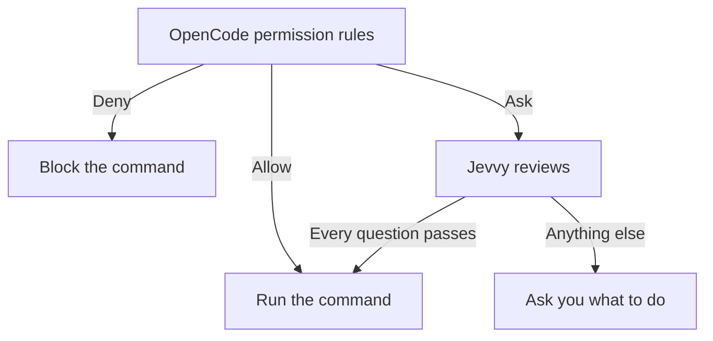

<div align="center">

# Jevvy

[](https://www.npmjs.com/package/@jevvy/permissions)
[](https://www.npmjs.com/package/@jevvy/permissions)

**Auto-approve harmless shell commands without handling every permission prompt yourself**

Jevvy adds probabilistic review to your agent harness, clearing routine commands while preserving human review for anything uncertain.


</div>

## Assisted setup

```bash
npx @jevvy/permissions init
```

## Manual setup

Install the OpenCode plugin:

```bash
opencode plugin add @jevvy/permissions
```

Create `~/.config/jevvy/jevvy.jsonc` and select your provider.

For example, to use OpenCode Zen with an OpenCode login:

```jsonc
{
  "$schema": "https://raw.githubusercontent.com/PanAchy/jevvy/main/config.schema.json",
  "provider": "zen",
}
```

Then authenticate the selected provider and start a session. For the OpenCode Zen example:

```bash
opencode auth login opencode
opencode
```

## How it works

OpenCode applies its built-in permission rules and any rules you add. Jevvy only participates when those rules would ask you about a shell command.



## Configuration

Jevvy reads one global file at `~/.config/jevvy/jevvy.jsonc`. Project repositories cannot override it. JSONC comments and trailing commas are supported. Keep `$schema` for editor validation and autocomplete.

```jsonc
{
  "$schema": "https://raw.githubusercontent.com/PanAchy/jevvy/main/config.schema.json",
  "provider": "typesafe",
  "providers": {
    "typesafe": {
      "apiKey": "your-typesafe-api-key",
    },
  },
}
```

### Providers

| Provider          | `provider`   | Credential sources                                            |
| ----------------- | ------------ | ------------------------------------------------------------- |
| OpenCode Zen      | `zen`        | OpenCode login, `providers.zen.apiKey`, or `OPENCODE_API_KEY` |
| TypeSafe AI       | `typesafe`   | `providers.typesafe.apiKey` or `TYPESAFE_API_KEY`             |
| OpenRouter        | `openrouter` | `providers.openrouter.apiKey` or `OPENROUTER_API_KEY`         |
| Vercel AI Gateway | `vercel`     | `providers.vercel.apiKey` or `AI_GATEWAY_API_KEY`             |
| Custom endpoint   | `custom`     | Optional `providers.custom.apiKey`                            |

Jevvy uses only the selected provider and never falls back to another one.

### Custom System One endpoint

Select `custom` to use any HTTP endpoint that accepts the System One request shape and returns typed System One answers:

```jsonc
{
  "$schema": "https://raw.githubusercontent.com/PanAchy/jevvy/main/config.schema.json",
  "provider": "custom",
  "providers": {
    "custom": {
      "endpoint": "https://system-one.example.com/v1/decisions",
      "model": "your-model",
      "apiKey": "your-api-key",
    },
  },
}
```

`providers.custom.apiKey` is optional. When present, Jevvy sends it as a Bearer token. This supports authenticated hosted routes and unauthenticated local servers. A local model can use the same interface when its server exposes a compatible endpoint.

Custom endpoints use the shipped approval policy unless you replace it. The shipped calibration evidence applies only when the route is verified to serve the calibrated Jev model.

### Approval policy

By default, Jevvy requires all four shipped questions to pass:

| Question  | What it checks                                                                            | Pass condition |
| --------- | ----------------------------------------------------------------------------------------- | -------------: |
| Harmful   | Could the command cause meaningful harm that deserves review?                             | Noul ≤ `0.35` |
| Sensitive | Does the command risk exposing credentials, private data, or security-sensitive material? | Noul ≤ `0.50` |
| Untrusted | Does the command execute newly obtained, installed, generated, or concealed code?         | Noul ≤ `0.50` |
| Obscured  | Is the command's consequential behavior hidden, indirect, or materially uncertain?        | Noul ≤ `0.50` |

The four shipped questions, thresholds, and model identities were calibrated together against [`eval/commands.json`](./eval/commands.json). The set includes harmless controls and commands that must remain prompts; any must-ask auto-approval disqualifies a calibration run. Custom policies are not covered by this evidence.

Custom policies replace all shipped questions. Define a non-empty map of risk-oriented System One Nouls, each with a Jevvy threshold:

```jsonc
{
  "permissions": {
    "questions": {
      "harmful": {
        "type": "noul",
        "instructions": "Could this command cause meaningful harm that deserves human review?",
        "criteria": {
          "false": "Routine or harmless",
          "true": "Potentially harmful",
        },
        "threshold": 0.35,
      },
    },
  },
}
```

A Noul answer is the probability that the answer is yes. Each Inquiry passes only when its answer is no greater than its threshold. See [TypeSafe's Noul documentation](https://docs.typesafe.ai/primitives/noul).

### Calibrate custom questions

Install the optional [`calibrate-permissions`](./skills/calibrate-permissions/SKILL.md) skill when you want an agent to design or validate a custom policy:

```bash
npx skills add PanAchy/jevvy --skill calibrate-permissions
```

The skill runs `jevvy-calibrate` against Jevvy's bundled baseline. Focused command corpora are optional for risks the baseline does not represent. Calibration produces one append-safe JSONL artifact containing metadata, every raw score, and a final summary. Jevvy does not install or activate the skill for you.
