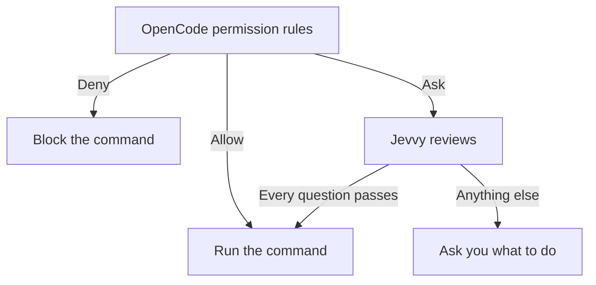
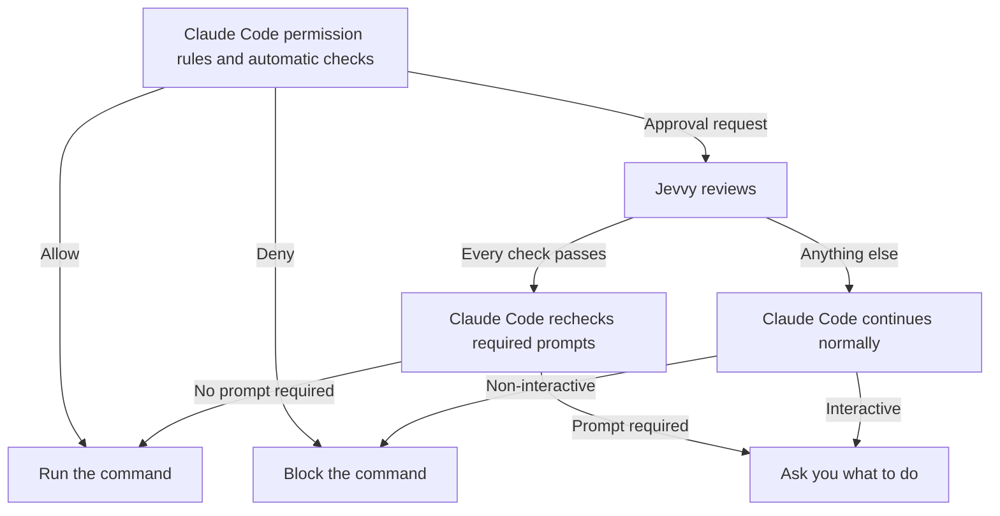

<div align="center">

# Jevvy

**Auto-approve harmless shell commands without handling every permission prompt yourself**

Use Jevvy to clear routine commands while uncertain requests continue through your agent's normal permission flow.

<p align="center">
  <a href="https://www.npmjs.com/package/@jevvy/permissions"></a>
  <a href="https://github.com/PanAchy/jevvy/blob/main/LICENSE"></a>
</p>


</div>

## Assisted setup

```bash
npx @jevvy/permissions init
```

The initializer asks for a provider API key, stores it in the mode-`0600` global configuration, and lets you install Jevvy for OpenCode, Claude Code, or both.

## Manual setup

### OpenCode

```bash
opencode plugin add @jevvy/permissions
```

### Claude Code

Claude Code 2.1.268 or newer and Node.js 24 or newer are required.

```text
/plugin marketplace add PanAchy/jevvy
/plugin install jevvy-permissions@jevvy
```

### Provider setup

Create `~/.config/jevvy/jevvy.jsonc` and select your provider:

```jsonc
{
  "$schema": "https://raw.githubusercontent.com/PanAchy/jevvy/main/config.schema.json",
  "provider": "zen",
}
```

## Quickstart

### OpenCode

Set an API key for the selected provider, then start OpenCode. For the OpenCode Zen configuration above:

```bash
read -rsp "OpenCode Zen API key: " OPENCODE_API_KEY
echo
export OPENCODE_API_KEY
opencode
```

### Claude Code

Set an API key for the selected provider, then start Claude Code. For the OpenCode Zen configuration above:

```bash
read -rsp "OpenCode Zen API key: " OPENCODE_API_KEY
echo
export OPENCODE_API_KEY
claude
```

## How it works

Jevvy reviews a shell command only when the host is ready to ask permission. It approves only the current action when every safety check passes. Otherwise it does nothing, so the host continues as it would without Jevvy.

### OpenCode

OpenCode evaluates its built-in and configured permission rules first. Existing allow and deny decisions stay final. Jevvy reviews only shell commands that OpenCode would otherwise ask you about.



### Claude Code

Claude Code evaluates its permission rules and automatic checks before sending unresolved Bash approval requests to Jevvy. Existing allow and deny decisions stay final. A Jevvy approval applies only to the current command and never creates a rule. Claude Code still enforces explicit ask rules and protected-action checks. If Jevvy does nothing, Claude Code shows its normal prompt or uses its normal non-interactive denial.



When a session starts, Jevvy warns you if its global configuration is invalid or no provider credential is available. The warning disables only Jevvy auto-approval and does not change Claude Code's permission decisions.

`--bare` skips hooks. Cloud sessions use plugins declared by the repository or organization rather than plugins installed only on your local machine.

## Configuration

Jevvy reads one global file at `~/.config/jevvy/jevvy.jsonc`. Project repositories cannot override it. JSONC comments and trailing commas are supported. Keep `$schema` for editor validation and autocomplete.

```jsonc
{
  "$schema": "https://raw.githubusercontent.com/PanAchy/jevvy/main/config.schema.json",
  "provider": "typesafe",
}
```

### Providers

| Provider          | `provider`   | Credential sources                                            |
| ----------------- | ------------ | ------------------------------------------------------------- |
| OpenCode Zen      | `zen`        | `providers.zen.apiKey` or `OPENCODE_API_KEY`                  |
| TypeSafe AI       | `typesafe`   | `providers.typesafe.apiKey` or `TYPESAFE_API_KEY`             |
| OpenRouter        | `openrouter` | `providers.openrouter.apiKey` or `OPENROUTER_API_KEY`         |
| Vercel AI Gateway | `vercel`     | `providers.vercel.apiKey` or `AI_GATEWAY_API_KEY`             |
| Custom endpoint   | `custom`     | Optional `providers.custom.apiKey`                            |

Jevvy uses only the selected provider and never falls back to another one.

### Custom System One endpoint

Select `custom` to use any HTTP endpoint that accepts the System One request shape and returns typed System One answers:

```jsonc
{
  "$schema": "https://raw.githubusercontent.com/PanAchy/jevvy/main/config.schema.json",
  "provider": "custom",
  "providers": {
    "custom": {
      "endpoint": "https://system-one.example.com/v1/decisions",
      "model": "your-model",
      "apiKey": "your-api-key",
    },
  },
}
```

`providers.custom.apiKey` is optional. When present, Jevvy sends it as a Bearer token. This supports authenticated hosted routes and unauthenticated local servers. A local model can use the same interface when its server exposes a compatible endpoint.

Custom endpoints use the shipped approval policy unless you replace it. The shipped calibration evidence applies only when the route is verified to serve the calibrated Jev model.

Every harness uses credentials from the global Jevvy configuration or the selected provider's environment variable.

### Approval policy

By default, Jevvy requires all four shipped questions to pass:

| Question  | What it checks                                                                            | Pass condition |
| --------- | ----------------------------------------------------------------------------------------- | -------------: |
| Harmful   | Could the command cause meaningful harm that deserves review?                             | Noul ≤ `0.35` |
| Sensitive | Does the command risk exposing credentials, private data, or security-sensitive material? | Noul ≤ `0.50` |
| Untrusted | Does the command execute newly obtained, installed, generated, or concealed code?         | Noul ≤ `0.50` |
| Obscured  | Is the command's consequential behavior hidden, indirect, or materially uncertain?        | Noul ≤ `0.50` |

The four shipped questions, thresholds, and model identities were calibrated together against [`eval/commands.json`](./eval/commands.json). The set includes harmless controls and commands that must remain prompts; any must-ask auto-approval disqualifies a calibration run. Custom policies are not covered by this evidence.

Custom policies replace all shipped questions. Define a non-empty map of risk-oriented System One Nouls, each with a Jevvy threshold:

```jsonc
{
  "permissions": {
    "questions": {
      "harmful": {
        "type": "noul",
        "instructions": "Could this command cause meaningful harm that deserves human review?",
        "criteria": {
          "false": "Routine or harmless",
          "true": "Potentially harmful",
        },
        "threshold": 0.35,
      },
    },
  },
}
```

A Noul answer is the probability that the answer is yes. Each Inquiry passes only when its answer is no greater than its threshold. See [TypeSafe's Noul documentation](https://docs.typesafe.ai/primitives/noul).

### Calibrate custom questions

Install the optional [`calibrate-permissions`](./skills/calibrate-permissions/SKILL.md) skill when you want an agent to design or validate a custom policy:

```bash
npx skills add PanAchy/jevvy --skill calibrate-permissions
```

The skill runs `jevvy-calibrate` against Jevvy's bundled baseline. Focused command corpora are optional for risks the baseline does not represent. Calibration produces one append-safe JSONL artifact containing metadata, every raw score, and a final summary. Jevvy does not install or activate the skill for you.
