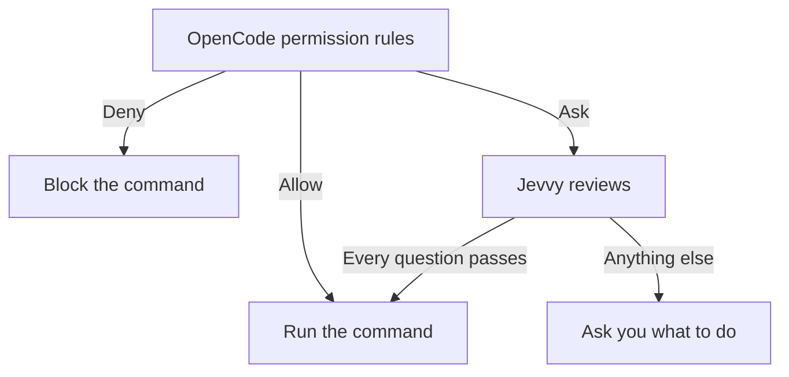

<div align="center">

# Jevvy

[](https://www.npmjs.com/package/@jevvy/permissions)
[](https://www.npmjs.com/package/@jevvy/permissions)

**Auto-approve harmless shell commands without handling every permission prompt yourself**

Jevvy adds probabilistic review to your agent harness, clearing routine commands while preserving human review for anything uncertain.


</div>

## Assisted setup
```bash
npx @jevvy/permissions init
```

The initializer lets you select agent harnesses and a System One provider, stores credentials in the mode-`0600` global configuration, and installs the harness integration. OpenCode is the first available harness.

## Manual setup

Install the OpenCode plugin:

```bash
opencode plugin add @jevvy/permissions
```

Create `~/.config/jevvy/jevvy.jsonc` and select your provider. For example, to use OpenCode Zen with an OpenCode login:

```jsonc
{
  "$schema": "https://raw.githubusercontent.com/PanAchy/jevvy/main/config.schema.json",
  "provider": "zen"
}
```

Then authenticate the selected provider and start a session. For the OpenCode Zen example:

```bash
opencode auth login opencode
opencode
```

## How it works

OpenCode applies its built-in permission rules and any rules you add. Jevvy only participates when those rules would ask you about a shell command.



## Configuration

Jevvy reads one global file at `~/.config/jevvy/jevvy.jsonc`. Project repositories cannot override it. JSONC comments and trailing commas are supported. Keep `$schema` for editor validation and autocomplete. Without an explicitly selected provider or its required credential, OpenCode marks Jevvy as failed and its remaining permission flow continues unchanged. Run `/plugins` and open the Jevvy entry to see the setup error.

```jsonc
{
  "$schema": "https://raw.githubusercontent.com/PanAchy/jevvy/main/config.schema.json",
  "provider": "typesafe",
  "providers": {
    "typesafe": {
      "apiKey": "your-typesafe-api-key",
    },
  },
}
```

### Provider

| Setting                       | Required | Purpose                                      |
| ----------------------------- | -------- | -------------------------------------------- |
| `provider`                    | yes      | Select `zen`, `typesafe`, `openrouter`, `vercel`, or `custom` |
| `providers.zen.apiKey`        | no       | Use OpenCode Zen without an OpenCode login   |
| `providers.typesafe.apiKey`   | no       | Use TypeSafe AI                              |
| `providers.openrouter.apiKey` | no       | Use OpenRouter                               |
| `providers.vercel.apiKey`     | no       | Use Vercel AI Gateway                        |

Jevvy uses only the selected provider and never falls back to another one. For OpenCode Zen, the OpenCode adapter can use an active OpenCode OAuth or API-key login instead of `providers.zen.apiKey`. The built-in providers also read their native environment variables: `OPENCODE_API_KEY`, `TYPESAFE_API_KEY`, `OPENROUTER_API_KEY`, and `AI_GATEWAY_API_KEY`.

### Custom System One endpoint

Select `custom` to use any HTTP endpoint that accepts the System One request shape and returns typed System One answers:

```jsonc
{
  "$schema": "https://raw.githubusercontent.com/PanAchy/jevvy/main/config.schema.json",
  "provider": "custom",
  "providers": {
    "custom": {
      "endpoint": "https://system-one.example.com/v1/decisions",
      "model": "your-model",
      "apiKey": "your-api-key"
    }
  },
  "permissions": {
    "questions": {
      "harmful": {
        "type": "noul",
        "instructions": "Could this command cause meaningful harm that deserves human review?",
        "criteria": {
          "false": "Routine or harmless",
          "true": "Potentially harmful"
        },
        "threshold": {
          "direction": "atMost",
          "value": 0.35
        }
      }
    }
  }
}
```

`providers.custom.apiKey` is optional. When present, Jevvy sends it as a Bearer token. This supports authenticated hosted routes and unauthenticated local servers. A local model can use the same interface when its server exposes a compatible endpoint.

The `permissions.questions` block above illustrates an optional replacement policy. Custom endpoints use the complete shipped question set when it is omitted. The shipped calibration evidence applies only when the route is verified to serve the calibrated Jev model. Other models can use the same question shape, but they do not inherit that evidence.

### Approval policy

Set `permissions.questions` to a non-empty question map to replace the complete approval policy.

For built-in providers, omitting `permissions.questions` requires all four shipped questions to pass:

| Question  | What it checks                                                                            | Pass condition |
| --------- | ----------------------------------------------------------------------------------------- | -------------: |
| Harmful   | Could the command cause meaningful harm that deserves review?                             | score ≤ `0.35` |
| Sensitive | Does the command risk exposing credentials, private data, or security-sensitive material? | score ≤ `0.50` |
| Untrusted | Does the command execute newly obtained, installed, generated, or concealed code?         | score ≤ `0.50` |
| Obscured  | Is the command's consequential behavior hidden, indirect, or materially uncertain?        | score ≤ `0.50` |

The four questions, thresholds, and model identities were calibrated together against [`eval/commands.json`](./eval/commands.json). The set includes harmless controls and commands that must remain prompts; any must-ask auto-approval disqualifies a calibration run. Replacing `permissions.questions` creates a custom policy that is not covered by this evidence.

### Calibrate custom questions

Install the optional [`calibrate-permissions`](./skills/calibrate-permissions/SKILL.md) skill when you want an agent to design or validate a custom policy:

```bash
npx skills add PanAchy/jevvy --skill calibrate-permissions
```

The skill runs `jevvy-calibrate` against Jevvy's bundled baseline. Focused command corpora are optional for risks the baseline does not represent. Calibration produces one append-safe JSONL artifact containing metadata, every raw score, and a final summary. Jevvy does not install or activate the skill for you.
